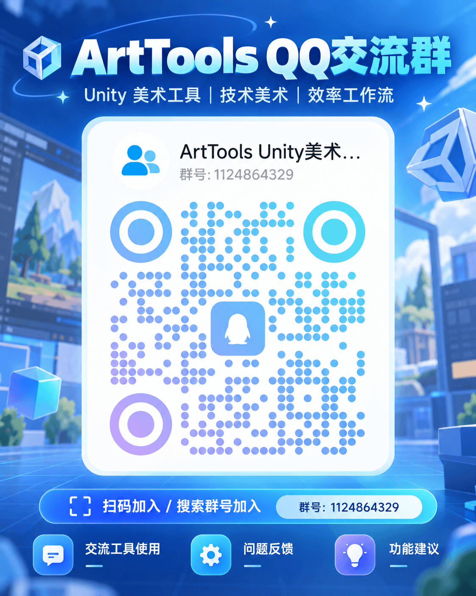

# Art Tools · Unity 美术工具箱



**扫码加入 ArtTools QQ 交流群，或搜索群号：1124864329。** 欢迎交流工具使用、反馈问题和提出功能建议。

Art Tools 是面向 Unity 美术制作的编辑器工具合集，提供截图与序列图导出、贴图检查、资源整理、批量命名、Missing Script 检查、材质检查与转换、场景操作、平滑法线烘焙等功能。

本仓库是持续维护的 Unity Package Manager 版本。原始的 `lishuo0617/ArtTools` 仓库为独立快照，不是此包的开发仓库。

## 兼容性

- 包清单标注的最低版本是 Unity 2018.4；本次更新在 Unity 2021.3 和 Unity 2022.3 完成验证。Unity 2019.4.21f1c1 测试发现原有截图快捷键与 Prefab 检查代码的编译错误，暂未通过该版本验证。
- 源码保留 Unity 2017 的 API 兼容处理；Unity 2017 请使用原始的手动导入版本。
- 编辑器工具支持 Built-in、URP 和 HDRP 项目。使用材质转换功能前，项目中须安装目标渲染管线和对应 Shader。

## 通过 Package Manager 安装

在 Unity 中打开 `Window > Package Manager`，选择 `Add package from git URL`，输入以下地址。

**持续更新通道**（希望在 Package Manager 中点击 **Update** 获取后续已验证版本，推荐使用）：

```text
https://github.com/lishuo0617/ArtTools-UPM.git#stable
```

**固定版本**（适合需要锁定版本的项目）：

```text
https://github.com/lishuo0617/ArtTools-UPM.git#v1.2.4
```

也可以在项目的 `Packages/manifest.json` 中加入：

```json
{
  "dependencies": {
    "com.lishuo.arttools": "https://github.com/lishuo0617/ArtTools-UPM.git#stable"
  }
}
```

安装后，从 Unity 顶部菜单打开 `Art Tools > 美术工具中心`。选中 Package Manager 中的 **Art Tools** 时，也能在详情区看到交流群信息和二维码。

## 更新说明

- 使用 `#stable` 通道时，可以在 Package Manager 中点击 **Update** 获取最新的已验证版本。
- 早期视频中的 `#v1.1.0` 地址仍作为旧用户的滚动更新通道，与 `stable` 一起推进。
- `#v1.2.4` 这类正式版本标签用于锁定版本，不会自动跳转到其他版本标签。
- 包遵循语义化版本：不兼容变更增加主版本号，兼容的新工具增加次版本号，修复增加修订号。

## 使用前提醒

运行批量处理功能前，请备份或提交项目资源。材质和贴图处理工具可能修改选中的项目文件。
